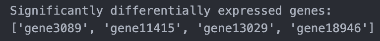

Headings

# Heading level 1
## Heading level 2
### Heading level 3
...
###### Heading level 6

Alternative Syntax

Heading level 1
===============

---

Paragraphs

I really like using Markdown.

---

Bold
**bold text**
__bold text__

---

Italic

*cat's meow*
_cat's meow_

---

Bold and Italic

***really***
___really___
__*really*__

---

Blockquotes

> Dorothy followed her through...

> A
>
> B

> A
>
>> B

> #### The quarterly results look great!
>
> - Revenue was off the chart.
> - Profits were higher than ever.
> *Everything* is going according to **plan**.

---

Lists

1. A
2. B
3. C
1. D

- A
- B
- C

- First item
- Second item
- Third item
    - Indented item
    - Indented item
- Fourth item

---

Code

`nano`

``Use `code` in your Markdown file.``

---

Links

My favorite search engine is [Google](www.google.com).

My favorite search engine is [Google](www.google.com "The best search engine").

---

Images

